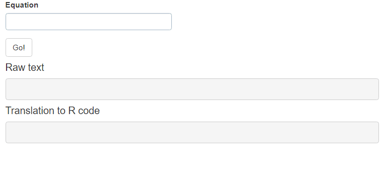

```{r, include = FALSE}
knitr::opts_chunk$set(
  collapse = TRUE,
  comment = "#>",
  fig.path = "man/figures/README-",
  out.width = "100%"
)
```


# shinymath

<!-- badges: start -->
[](https://www.tidyverse.org/lifecycle/#experimental)
<!-- badges: end -->

`shinymath` is a small R package that provides a mathematical input to shiny apps.
This input is based on [Mathquill](http://mathquill.com/) and by default returns
a LaTeX expression. This package also uses functions from [`latex2r`](https://github.com/tomicapretto/latex2r)
that make it possible to transform the LaTeX expressions to R code/functions.

## Installation

You can install the development version from [GitHub](https://github.com/) with:

``` r
# install.packages("remotes")
remotes::install_github("tomicapretto/shinymath")
```

## Basic usage

Within your UI, you call `mathInput()` as you would do with any other input.

```{r, eval = FALSE}
mathInput(inputId = "equation", label = "Math equation")
```

## Examples

### Quickstart

Just a quick example to see `mathInput()` together with `latex2r()` in action.

```{r example, eval=FALSE}
library(shiny)
library(shinymath)

ui = fluidPage(
  title = "Hello shinymath!",
  mathInput("math", "Equation"),
  actionButton("go", "Go!"),
  h4("Raw text"),
  verbatimTextOutput("text_raw", placeholder = TRUE),
  h4("Translation to R code"),
  verbatimTextOutput("text_r", placeholder = TRUE)
)

server = function(input, output) {
  math = eventReactive(input$go, input$math)
  output$text_raw = renderText(math())
  output$text_r = renderText(latex2r(math()))
}

shinyApp(ui, server)
```



### All features demo

The app has a small shiny app that shows the features related to `mathInput()` and 
functions exported from `latex2r` package. Use `launch_demo()` to see it.

## Notes

While you can write any math that is accepted by Mathquill, not everything can be 
translated to R. Since this package relies on the parser in `latex2r` for 
translation purposes, it comes with all the limitations there. 
For more information about the particularities of `latex2r`, see 
[these notes](https://github.com/tomicapretto/latex2r/blob/master/README.md#supported-latex).


However, many _common_ mathematical equations can be written and translated to R
code with no problem. [Here](https://github.com/tomicapretto/latex2r#examples-1) 
you have  a list of math equations in LaTeX and their corresponding translation to R.   


A good choice is to wrap `latex2r()` call within a `tryCatch()` block to handle
parsing errors in a custom way. When the parser does not understand the math expression,
it raises an error of class `latex2r.error`. Within your shiny app, you can use
something like

```{r, eval=FALSE}
latex2r_safe = function(code) {
  tryCatch({
    latex2r(code)
  },
  latex2r.error = function(cnd) {
    showNotification(
      paste("Error when translating to R code -", cnd$message),
      type = "error"
    )
  },
  error = function(cnd) {
    showNotification("Unexpected error", type = "error")
  })
}
```

which will return the translated expression if it works and will show a notification
if it fails.
